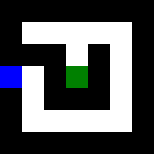

# MazeMachineLearning
MazeMachineLearning is a C# application with the core functionality of creating and running a Reinforcement Learning environment to solve a maze.

Currently the 

This repository contains a console and API implementation

Below are tutorials for each implementation

## Console 

`cd` into the main folder (the one containing all the projects)

Run the following command

`dotnet run --project MazeMachineLearning`

If you do not run it this way then the program wont work.

### Adding your own maze

If you'd like to add your own maze to the mazeImages folder, then follow the example below

#### Maze Color Hex 

Walls: 000000
Start: 008000
End: 0000FF

1. Sorround the entire maze with a black border
2. Have start pizel withinthe border
3. End pixel can be within or outside of the border

## API

**Warning:** I am not hosting an API for this program, this is a tutorial for running it locally

`cd` into the main folder (the one containing all the projects)

Run the following command

`dotnet run --project MazeMachineLearning.API`

The output shows where the API takes requests from, and from there you can implement it into.